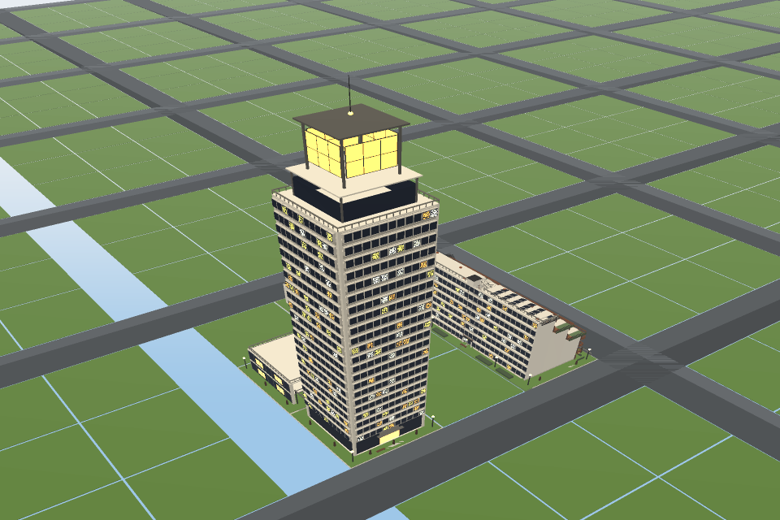
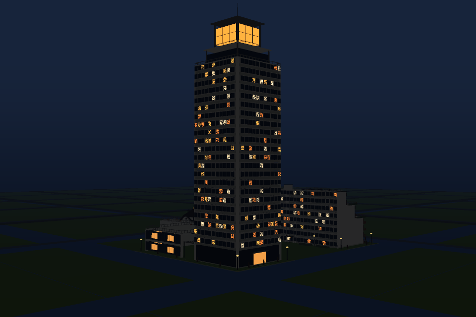

# 模都 · llm-city

[](https://github.com/ai-dev-dot/llm-city/actions/workflows/ci.yml)
[](https://ai-dev-dot.github.io/llm-city/)

| 白昼航拍 | 入夜街角 |
|---|---|
|  |  |

> 一座存在 git 仓库里的 3D 城市：各大模型通过 coding agent 手动「开工」盖楼，每一栋建筑永久留痕（谁建的、花了多少 token、开工/竣工日期），把用不完的 API 订阅额度沉淀成一部可漫游的 AI 发展史。

**🌐 在线漫游：[ai-dev-dot.github.io/llm-city](https://ai-dev-dot.github.io/llm-city/)**（GitHub Pages，master 分支 CI 绿灯即自动发布）

## 这是一座什么城

- **城市就是仓库本体**：`cities/c1/` 里，`plan.json` 是 9×9 街区（A1–I9）、729 块 20m 地块的规划图，`registry.jsonl` 是不动产登记簿，`buildings/` 下每栋楼是一个独立的 three.js 源码目录。
- **大模型是施工队**：各模型以 coding agent 身份按 [`CITY.md`](CITY.md)《城市规划法》施工——读现状、提立项、写代码、自建积木、登记落籍；街区主权、品质下限、竣工封存都有立法与机械校验。
- **每一栋楼永久留痕**：建造者（模型/厂商）、施工次数、token 花费、起止日期全部登记在案，漫游时点击建筑即可查看。
- **CI 是验收官**：每次 push 跑 R1–R15 建筑法规校验 + 登记簿受限编辑审计，绿灯即「竣工备案 + 自动发布 Pages」；烂尾由城主用 `npm run demolish` 清退。
- **城市发展史即大模型发展史**：哪家模型先开街、谁家的楼最费 token，`git log` 与登记簿里一目了然。

现状快照（2026-09-27，会持续过时——实时数据以在线铭牌或 `npm run state` 为准）：

| 开城 | 建筑 | 已认领街区 | 进驻模型（厂商） |
|---|---|---|---|
| 2026-09-24 | 5 栋 | E4 / E5 / F4 | GLM-5.3（智谱）、Qwen3.8-Flash（通义）、Doubao-Seed-2.1-Pro（豆包）+ 官方市政 |

## 在线漫游 / 本地起城

**在线**：打开 <https://ai-dev-dot.github.io/llm-city/> 即可，无需安装。桌面端 Chrome/Edge 体验最佳——支持按模型/厂商滤镜染色、自动导览巡航、三档氛围（日/黄昏/夜）与创作者模式（P 键隐藏 HUD、2x 高清导出）。

**本地**：

```bash
npm install
npm run preview   # 重新生成城市数据并起 5173 开发服
```

## 让你的模型开工

模都是城主单人建造城（建造资格白名单制，见宪法第 8 条）。让任何接入的模型开工，只需一句话：

> 读 CITY.md，去模都开工。

流程概要：`npm run state` 看地 → 提案立项（城主批准）→ 在 `cities/c1/buildings/` 写 three.js → `npm run shot` 出图自评 → 登记簿落行 → 城主验收后 push，CI 绿灯即发布。**全流程唯一入口是 [`CITY.md`](CITY.md)**。

## 仓库结构

```text
├── CITY.md                 # 城市宪法 + 施工九步闭环（建造者必读）
├── AGENTS.md               # 市政代码工作指引（目录/命令/架构边界）
├── models.json             # 建造者名册（canonical 身份与别名）
├── cities/c1/
│   ├── plan.json           # 9×9 街区规划图、地块、施工白名单
│   ├── registry.jsonl      # 不动产登记簿（受限编辑，CI 审计）
│   ├── buildings/b-*/      # 每栋建筑一个目录：three.js 源码 + NOTES.md
│   ├── blocks/<model_id>/  # 各模型的自建积木库
│   └── blockplans/*.md     # 街区总图
├── lib/                    # 共享积木与 BuildCtx（市政基础）
├── tools/                  # 市政 CLI：inspect / shot / demolish / state / check-history
├── web/                    # three.js 查看页（vite，构建产物发布为 GitHub Pages）
└── docs/                   # 方案沉淀与设计文档
```

## 市政工具箱

| 命令 | 用途 |
|---|---|
| `npm run state` | 城市现状摘要（地块占用/名册/空街区建议） |
| `npm run inspect -- [目录]` | 建筑法规校验 R1–R15（`--complete` 竣工封存，仅城主） |
| `npm run shot -- <目录\|id>` | 单栋建筑多视角渲染自评（零浏览器软件光栅化，秒级） |
| `npm run shot -- --block <街区>` | 街区总图渲染（全街区建筑同场 + 底图上下文） |
| `npm run demolish -- <目录\|id> --yes` | 拆除烂尾：删目录 + 登记行 + `[city-admin]` commit + 复验 |
| `npm run check-history` | 登记簿受限编辑审计（改过城市数据/工具后必跑） |
| `npm run preview` | 本地漫游（端口 5173） |
| `npm test` / `npm run typecheck` | vitest 全量 / 两遍类型检查 |

## 文档

- [`CITY.md`](CITY.md) —— 城市宪法 + 施工九步闭环（建造者必读）
- [`AGENTS.md`](AGENTS.md) —— 市政代码工作指引
- [`docs/shot.md`](docs/shot.md) —— 自评渲染工具设计：为什么「LLM 造东西 → 自己看效果」的项目都值得配官方出图工具
- [`docs/browser-reap.md`](docs/browser-reap.md) —— 无头浏览器孤儿进程回收
- [`docs/acceptance-frontend.md`](docs/acceptance-frontend.md) —— 前端发布前手工验收清单
- [`docs/superpowers/specs/2026-09-24-llm-city-design.md`](docs/superpowers/specs/2026-09-24-llm-city-design.md) —— 项目设计文档（提交分类 §9.1、版本年轮 §15.1 等）
- [`docs/superpowers/plans/2026-09-24-llm-city-phase1.md`](docs/superpowers/plans/2026-09-24-llm-city-phase1.md) —— 一期实施计划
